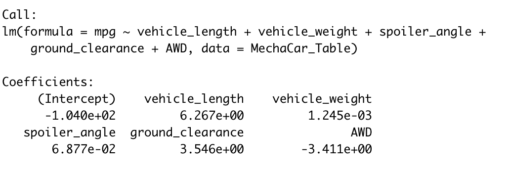
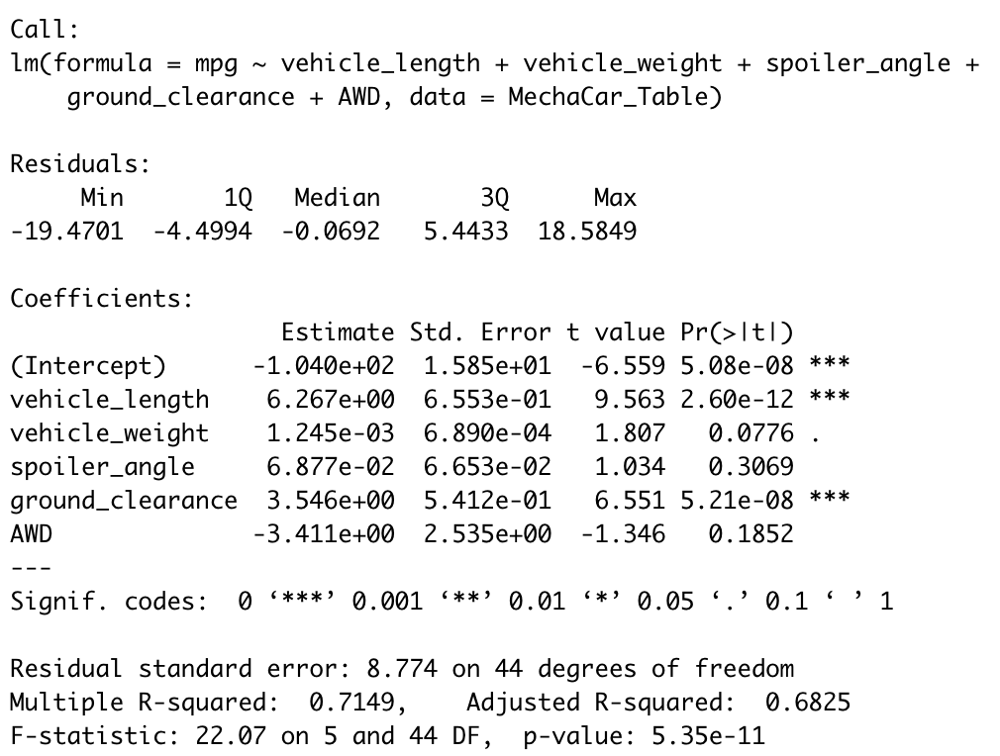

# MechaCar_Statistical_Analysis

## Purpose 

The purpose of this analysis is to look at an auto company's new car called the MechaCar. The analysis performed used data provided (the csv files) and using R and RStudio to do some basic statistic analysis. Using RStudio, tables for specific values were created for linear regression and t-tests. Below you will find the results and analysis, as well as study design to compare the MechaCar to other products on the market. 

## Results and Analysis 

### Linear Regression to Predict MPG 

First, the MecaCar csv was converted into a dataframe for RStudio, and then a mulitple linear regression was performed to see how the different aspects of the car (e.g. car length, weight, spoiler angle, etc) were affecting the miles per gallon (MPG). Below are the coeffiencts for equation determine the mpg based on the variables. 

 

This would give the equation MPG = 6.27(Vehicle Length) + 0.00125(Vehicle Weight) + 0.0688(Spoiler Angle) + 3.55(Ground Clearance) - 3.41(AWD) - 104.0  
Due to coeffiencets and the fact that y-intercept is -104, the slope of the line is not zero. 

However, what does this mean? What variables have the most impact on the MPG of the vehicle? Looking at the linear summary (below) we can see that according to the Pr(>|t|) column, that the vehicle's weight, spoiler angle and AWD have the most impact on MPG. All other variables are too small to have a significant impact. Since the R-value (the variable that shows how well a linear model fits the data) is at 0.71, the linear regression is somewhat useful to predict the MPG values of a car, though ideally an R-value should be at least 0.99. However, since no data is perfect, it is suggested that a R-value of at least 0.80 for reliable predictablility. 

 
