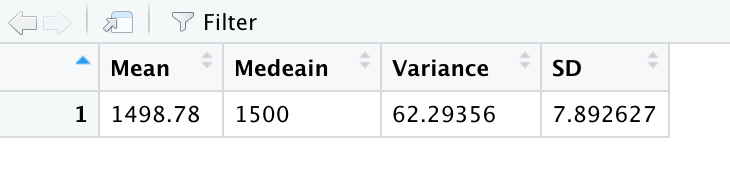
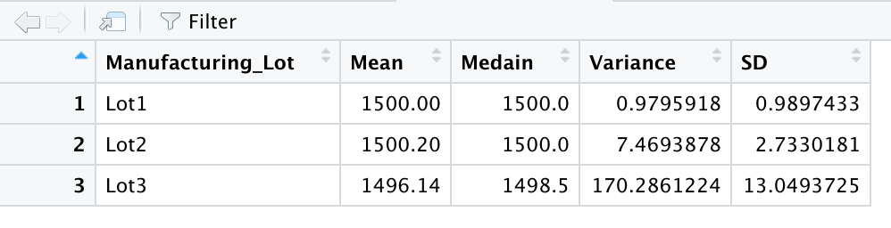

# MechaCar_Statistical_Analysis

## Purpose 

The purpose of this analysis is to look at an auto company's new car called the MechaCar. The analysis performed used data provided (the csv files) and using R and RStudio to do some basic statistic analysis. Using RStudio, tables for specific values were created for linear regression and t-tests. Below you will find the results and analysis, as well as study design to compare the MechaCar to other products on the market. 

## Results and Analysis 

### Linear Regression to Predict MPG 

First, the MecaCar csv was converted into a dataframe for RStudio, and then a mulitple linear regression was performed to see how the different aspects of the car (e.g. car length, weight, spoiler angle, etc) were affecting the miles per gallon (MPG). Below are the coeffiencts for equation determine the mpg based on the variables. 

 

This would give the equation MPG = 6.27(Vehicle Length) + 0.00125(Vehicle Weight) + 0.0688(Spoiler Angle) + 3.55(Ground Clearance) - 3.41(AWD) - 104.0  
Due to coeffiencets and the fact that y-intercept is -104, the slope of the line is not zero. 

However, what does this mean? What variables have the most impact on the MPG of the vehicle? Looking at the linear summary (below) we can see that according to the Pr(>|t|) column, that the vehicle's weight, spoiler angle and AWD have the most impact on MPG. All other variables are too small to have a significant impact. Since the R-value (the variable that shows how well a linear model fits the data) is at 0.71, the linear regression is somewhat useful to predict the MPG values of a car, though ideally an R-value should be at least 0.99. However, since no data is perfect, it is suggested that a R-value of at least 0.80 for reliable predictablility. 

 

### Summary Statistics on Suspension Coils

First the Suspicion Coil csv was converted into a dataframe and then created two subset tables with it: Total Summary and Lot Summary. The Total Summary table is looking at PSI statistics across all lots while the Lot Summary shows statistcs of each lot (seen below). As seen, Lot 1 and 2, are very similar while Lot 3 has a smaller mean with a bigger variance and standar deviation (SD). 

Total Summary

Lot Summary

### T-Tests on the PSI Values 

The P-values from single T-Test on PSI values (compared to the standard of 1500 PSI) for suspicion coils were: 
  * All PSI= 0.06028 
  * Lot 1 PSI= 1
  * Lot 2 PSI= 0.6072
  * Lot 3 PSI= 0.04168
  
Assuming that the significant value should be below p = 0.05 (which is standard), then only Lot 3 is significantly different. All other lots perform the same (or are not significantly different) to the standard 1500 PSI. This, combined with the lower mean of Lot 3 and high variance, could indicate that Lot 3 is under-performing. 

### Summary 

Based on the analysis above, the major impacts on MPG are car weight, spoiler angle, and AWD capability. This would mean for any improvement on the MPG of the MechaCar, designers and enigeers to consider these variables. In addition, when looking at suspicion coils, Lot 3 has the most variance and lower PSI average. This could mean that Lot 3 should not be used within the MechaCar. 

## Study Design MechaCar vs Competetition 

When it comes to comparing the MechaCar to its competition, the company should consider using an ANOVA test to compare the MechaCar in various categories that customers would care about: cost, city and highway fuel efficiency, horse power, safety rating, maintenance cost. ANOVA test is able to test to see if the means from multiple different samples are significantly similar or different. This means that the averages of different cars in these categories can be compared to the average of MecaCar. If the p value is greater than 0.05, then MecaCar has the same or similar performance within these categories (the null hypothesis). If the p value is less than 0.05, then MecaCar is significantly different in those categories. If it is significant different, then looking at the average of the MecaCar is the next step. If MecaCar's average is either below or above the other averages would show how it is performing against its competitors (below = worse, above = better).   

